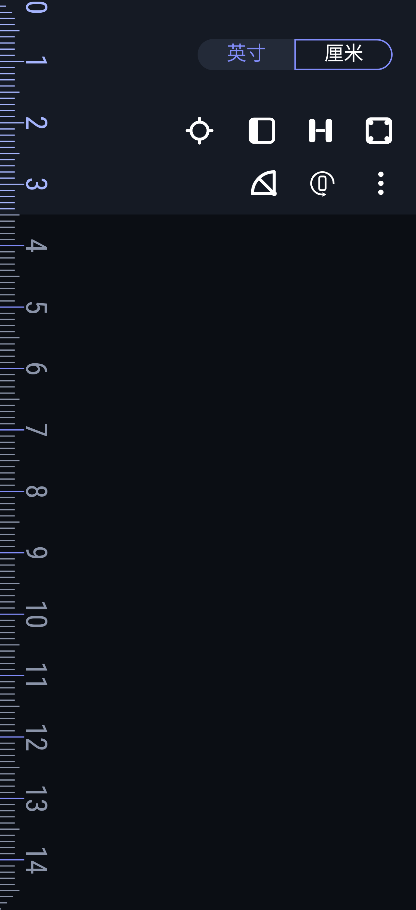
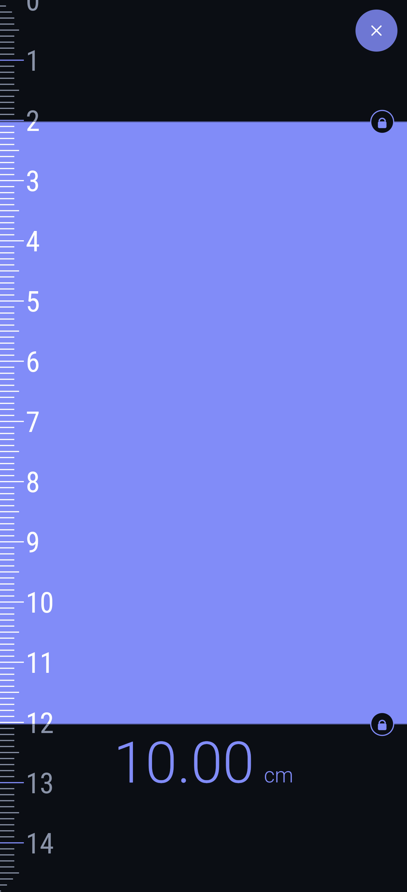
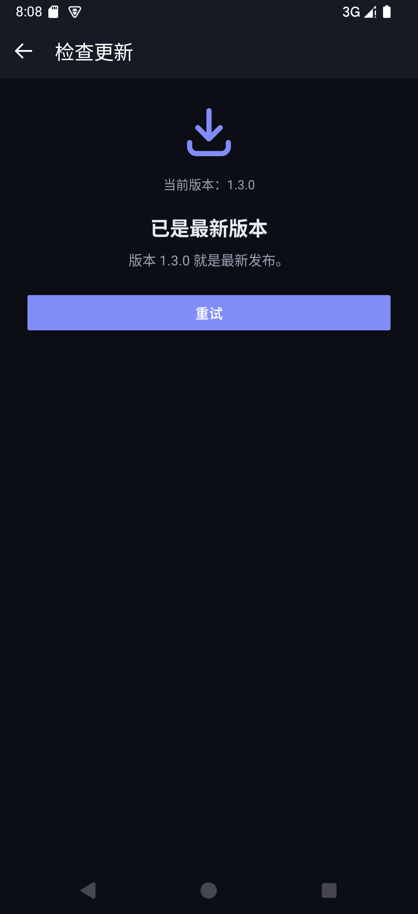

# 尺子 Ruler

[](https://github.com/MaximeMET/Ruler/releases/latest)
[](LICENSE)
[](https://github.com/MaximeMET/Ruler/releases/latest)

把手机屏幕变成尺子和量角器的开源 Android 应用。没有广告、没有统计、不会自己联网，
装完就是一把安静的尺子。

**下载**：[最新 Release](https://github.com/MaximeMET/Ruler/releases/latest) 里的 APK，
约 150 KB，支持 Android 6.0（API 23）及以上；装好之后可以在应用内直接检查更新。

## 为什么做这个

应用商店里的尺规应用功能都不差，但打开先看广告、量一下要联网、随手弹评分框，
工具本身反而被埋在最底下——而「把屏幕当尺子」这个需求本身，简单到不该有这些东西。

所以这个项目从头写了一个功能对等的版本，只坚持一条：**能离线用的功能就让它安安静静地离线**。
该删的依赖全删掉（没有广告 SDK、没有统计、没有第三方库），该加的功能一个不少，
安装包最终只有 150 KB——一把屏幕尺本来就该这么重。

## 功能

| 功能 | 说明 |
| --- | --- |
| 全屏尺子 | 刻度贴着屏幕长边，厘米 / 毫米 / 英寸三种单位，1 mm 或 1/8 inch 一格，数字始终横排 |
| 横竖屏 | 默认竖屏，工具栏旋转按钮一键切换，选择会被记住；设置里可选竖屏 / 横屏各自的反向 |
| 两点尺 | 两条可拖动的测量线，每条都能点小锁单独固定；点一下读数可以输入长度、两端一起固定，当一把固定长度的尺子用 |
| 矩形测量 | 拖动矩形实时显示宽、高与面积，竖屏和横屏都是两把标尺 |
| 量角器 | 半圆刻度盘，两根针都可以单独锁定，双指可同时调整夹角；点读数可以输入精确角度，竖屏读数横排在底部 |
| 校准 | 用银行卡长边（85.60 mm）做参照，加减按钮或直接拖动微调，系数实时保存并作用于所有模式 |
| 检查更新 | 应用内检查 GitHub 上的最新版本并交给系统安装器；平时不联网，只有主动打开这个页面才会访问网络 |

## 截图

| 尺子（竖屏，默认） | 尺子（横屏） | 矩形测量 | 量角器 |
| --- | --- | --- | --- |
|  |  |  |  |

| 两点尺（输入长度后两端固定） | 校准 | 设置 | 检查更新 |
| --- | --- | --- | --- |
|  |  |  |  |

## 权限与隐私

应用只声明两个权限，而且都只服务于「检查更新」：

* `INTERNET`：你点「检查更新」时访问 GitHub 的 Release 接口
* `REQUEST_INSTALL_PACKAGES`：把下载好的安装包交给系统安装器

不打开更新页，应用不会发出任何网络请求：没有后台服务、没有统计 SDK、没有账号，测量数据
也不会离开手机。安装包放在应用自己的缓存目录，通过私有的 `ContentProvider` 交给系统安装器，
所以连存储权限都不需要。

## 校准与精度

刻度的换算关系是：

```
每格像素 = 屏幕 xdpi（或 ydpi）/ 25.4 × 校准系数     // 厘米 / 毫米模式
每格像素 = 屏幕 xdpi（或 ydpi）/ 8 × 校准系数        // 英寸模式
```

手机上报的 `xdpi` / `ydpi` 只是厂家标称值，往往和真实尺寸有偏差，所以第一次使用建议先校准：
在校准页把银行卡的长边贴到蓝色方框上，用 `+` / `−` 或直接拖动刻度，直到银行卡完全对齐方框，
再点右上角保存。校准系数会作用于所有模式，直到你再次修改。

## 语言

界面跟随系统语言，也可以在任何一页的设置里单独指定。目前有 English、简体中文、繁體中文、
日本語、한국어、Español、Português (Brasil)、Français、Deutsch、Italiano、Русский、Türkçe、
العربية、हिन्दी、Bahasa Indonesia、Tiếng Việt、ไทย 共 17 种翻译。

想补充一种新语言：把 `app/src/main/res/values/strings.xml` 复制成 `values-<语言代码>/strings.xml`
翻译一遍，再把语言加进 `core/Locales.kt` 的 `choices` 与 `res/xml/locales_config.xml` 即可，
不需要改其它代码。

## 构建

需要 JDK 17 与 Android SDK（`compileSdk 35`）。项目自带 Gradle Wrapper：

```bash
# 调试包
./gradlew assembleDebug

# 发布包（默认用本地 debug keystore 签名，正式发布前请替换成自己的签名）
./gradlew assembleRelease
```

产物在 `app/build/outputs/apk/` 下。安装到手机：

```bash
adb install -r app/build/outputs/apk/debug/app-debug.apk
```

release 构建默认开启 R8 代码压缩与资源压缩，并剔除 Kotlin 的反射元数据，本仓库构建出来的
`app-release.apk` 约 150 KB（debug 包约 1 MB，因为它不做任何压缩）。

如果你 fork 了本项目，记得把 `app/src/main/java/org/openruler/app/core/Updater.kt` 里的
`RELEASES_API` 和 `AboutActivity.kt` 里的 `SOURCE_URL` 换成你自己的仓库地址，
应用内更新与「关于」页的源码按钮才会指向你的仓库。

## 项目结构

```
app/src/main/java/org/openruler/app/
├── MainActivity.kt              # 测量主界面（全屏尺子 + 工具）
├── CalibrationActivity.kt       # 校准界面
├── SettingsActivity.kt          # 设置界面
├── AboutActivity.kt             # 关于 / 许可
├── UpdateActivity.kt            # 应用内更新（检查 / 下载 / 安装）
├── ProtractorActivity.kt        # 可单独作为快捷方式启动的量角器
├── BaseActivity.kt              # 主题与调色板
├── core/                        # 单位换算、偏好设置、语言、更新器、调色板
└── view/                        # 尺子、两点尺、量角器、校准尺等自绘控件
```

## 出处与许可

这是一个**功能对等的重写**，不是原 APK 的重打包。界面交互参考了 Google Play 上的同类
尺规应用 `org.nixgame.ruler`（作者 Evgrafov Aleksei），但源码、图标与界面资源全部重新编写、
绘制，仓库里不含原应用的任何代码、图片、字体或 APK 文件，也没有移植它的广告（AdMob、
Pangle、AppLovin、Yandex、IronSource）、Firebase / AppMetrica 统计、评分弹窗与内购。

[MIT](LICENSE) 许可证，可以自由使用、修改、再发布（包括商用）。

软件按「现状」提供，不附带任何担保。尺子精度取决于触摸屏的像素密度标称值与校准结果，
测量值仅供参考，不作为计量依据。

## 更新日志

每个版本的完整改动见 [CHANGELOG.md](CHANGELOG.md)；安装包都在
[Releases](https://github.com/MaximeMET/Ruler/releases) 页面。
