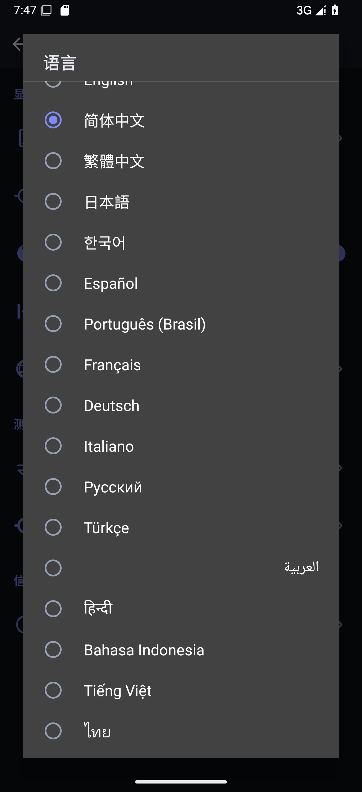
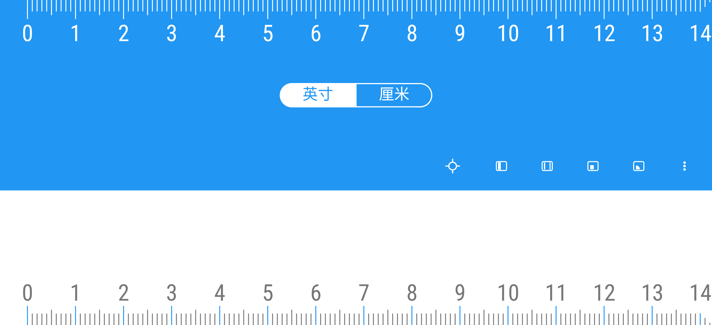
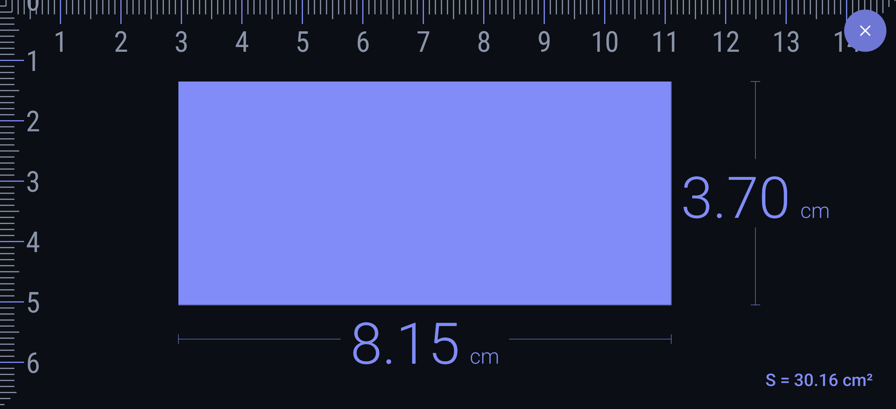
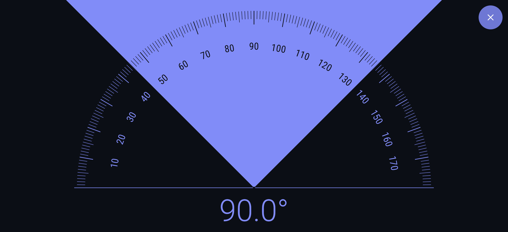
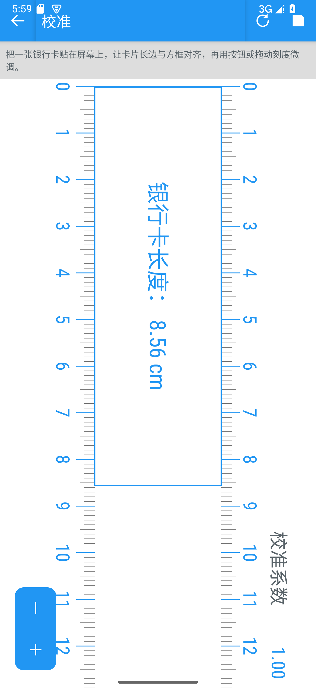
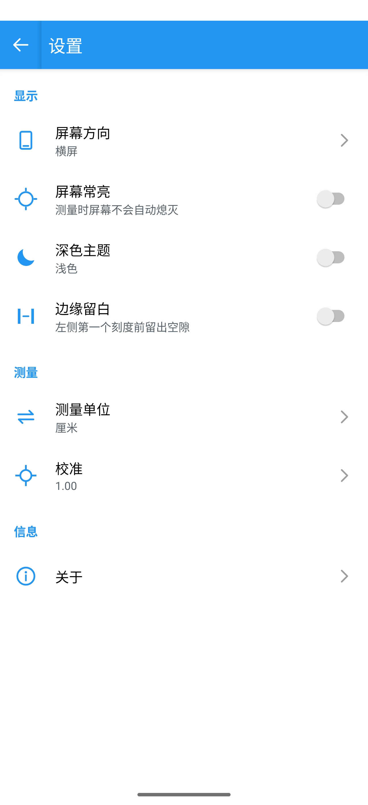
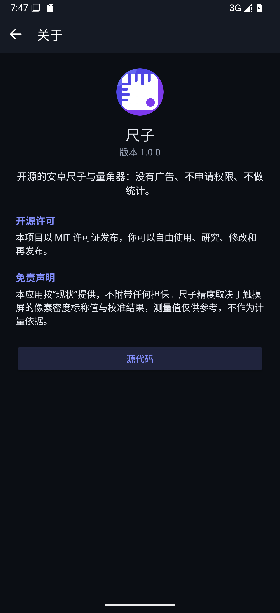
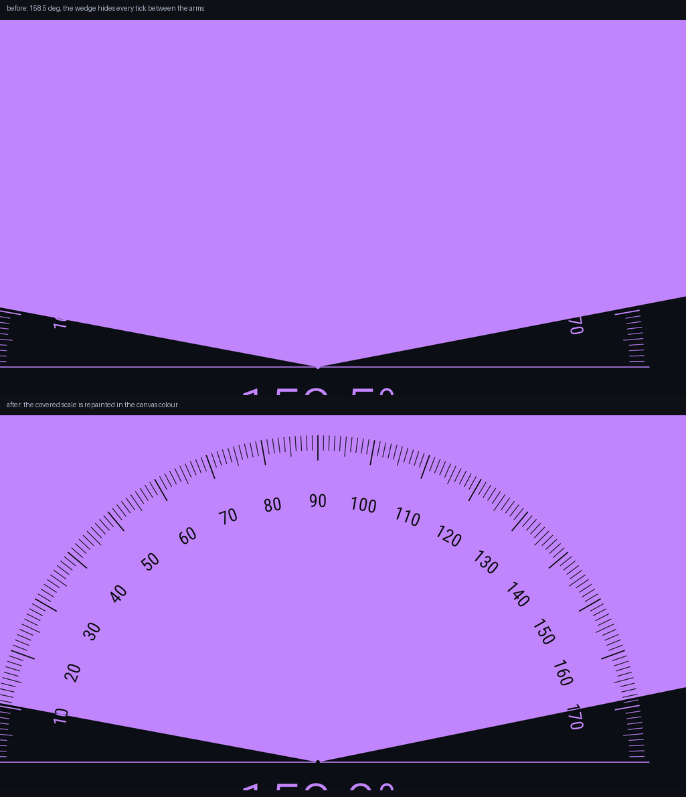
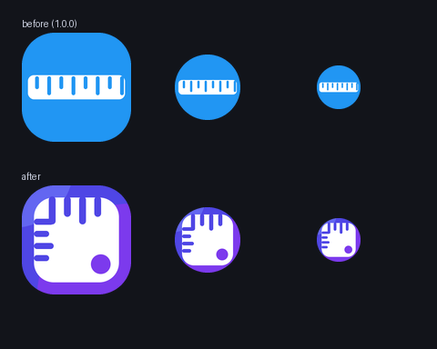
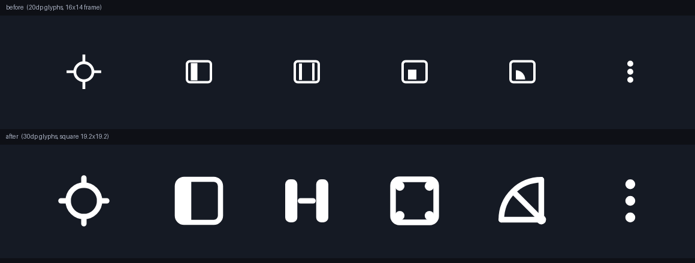

# 尺子 Ruler

一个开源的 Android 尺子 / 量角器应用：把手机屏幕当尺子用，测量厘米、毫米、英寸与角度。

界面与交互参考了 Google Play 上的同类尺规应用（`org.nixgame.ruler`，作者 Evgrafov Aleksei），
但**代码、图标和界面资源全部重写**，并且砍掉了原应用里的所有广告与统计 SDK。

* 没有广告：AdMob、Pangle、AppLovin、Yandex、IronSource、Firebase 等全部不存在
* 不申请任何权限：清单里连 `INTERNET` 都没有
* 零第三方依赖：只用 Android Framework + Kotlin 标准库，release 包约 110 KB
* 17 种语言，默认跟随系统语言，也可以在设置里单独指定
* 深色主题（默认）/ 浅色主题，靛蓝 + 紫罗兰配色
* 矢量自适应图标：Android 8+ 走自适应图标（含 Android 13 主题图标），旧系统用同一套图形的方角图标

## 功能

| 功能 | 说明 |
| --- | --- |
| 全屏尺子 | 顶部、底部、左侧三条刻度；厘米 / 毫米 / 英寸三种单位，1 mm 或 1/8 inch 一格 |
| 单点测量 | 一条可拖动的边，测量从屏幕边缘到该边的距离 |
| 两点测量 | 两条可拖动的边，测量两点之间的距离 |
| 矩形测量 | 可拖动矩形，实时显示宽、高与面积 |
| 量角器 | 半圆刻度盘，两根可拖动的针，双指可同时调整夹角；扇形里的刻度与数字会自动换成底色绘制，不会被填色盖住 |
| 校准 | 用银行卡长边（85.60 mm）做参照，加减按钮或直接拖动微调，系数实时保存 |
| 设置 | 屏幕方向、屏幕常亮、深色主题、边缘留白、语言、测量单位 |

## 语言

默认**跟随系统语言**；如果系统语言不在支持列表里，会回落到英文。设置页的「语言」一行可以在
应用内直接切换，列表里每一项都用该语言自己的写法（English、简体中文、日本語、Русский…），
不用先看懂当前界面也能找到自己的语言。

目前带完整翻译的语言：English、简体中文、繁體中文、日本語、한국어、Español、Português (Brasil)、
Français、Deutsch、Italiano、Русский、Türkçe、العربية、हिन्दी、Bahasa Indonesia、Tiếng Việt、ไทย。

实现方式不依赖 AndroidX：选项存在 `SharedPreferences`，每个 Activity 在 `attachBaseContext()`
里用 `createConfigurationContext()` 套上对应语言，所以在 Android 6 到 16 上行为一致；Android 13+
另外通过 `android:localeConfig` 注册到系统的「应用语言」页面，两处设置保持同步。
工具栏弹窗（英文）与所有读数里的数字固定用拉丁数字和小数点，和刻度上的数字保持一致。



想贡献新语言也很简单：把 `app/src/main/res/values/strings.xml` 复制成 `values-<语言代码>/strings.xml`
翻译一遍，再把语言加进 `core/Locales.kt` 的 `choices` 与 `res/xml/locales_config.xml` 就行，
不需要改其它代码。

## 截图

| 尺子 | 矩形测量 | 量角器 | 校准 |
| --- | --- | --- | --- |
|  |  |  |  |

| 设置（深色，默认） | 关于 |
| --- | --- |
|  |  |

量角器的扇形填充会盖住刻度，所以被扇形覆盖的那部分刻度与数字改用画布底色重绘：
修复前（上）张到 158.5° 时 30°~150° 的刻度全部消失，修复后（下）读数始终完整。
尺子的矩形测量用的是同一套办法。



## 配色与图标

配色全部重写过，主色 `#4F46E5`（靛蓝）配 `#7C3AED`（紫罗兰）：

| | 深色主题（默认） | 浅色主题 |
| --- | --- | --- |
| 画布 | `#0B0E14` 近黑 | `#F4F6FB` 低亮度灰白 |
| 工具栏 | `#151A24` | `#4F46E5` |
| 刻度高亮 | `#818CF8` | `#4F46E5` |
| 单点 / 两点 / 矩形 / 量角器 | `#60A5FA` / `#34D399` / `#FBBF24` / `#C084FC` | `#2563EB` / `#059669` / `#EA580C` / `#7C3AED` |

深色主题默认打开，因为纯白底在暗环境里太刺眼。工具栏、单位切换胶囊、设置页图标都按主题改色，
不再出现「深色底 + 白色控件」的硬拼色。

图标是矢量绘制的圆角方形尺身（占可见区约 78%），顶部刻度 + 左侧短刻度 + 挂孔，
同时提供自适应图标的前景、背景、单色三层，以及给 Android 7 及以下的方角版本。



首页工具栏上的按钮图标也一并重画：原来的单点 / 两点 / 矩形 / 量角器图标共用一个
16×14 的框，里面只有 1.6 单位的细线，再套上 14dp 内边距后实际只画到约 13×12dp，看起来又小又不方。
现在每个图标都按 19.2×19.2 的正方形绘制、线条加粗到 2.4~2.5 单位，按钮内边距减到 9dp，
也就是 48dp 的按钮里画 30dp 的图标，比原来大了约 60%。



## 构建

需要 JDK 17 与 Android SDK（`compileSdk 35`）。项目自带 Gradle Wrapper：

```bash
# 调试包
./gradlew assembleDebug

# 发布包（默认用本地 debug keystore 签名，正式发布前请替换成自己的签名）
./gradlew assembleRelease
```

第一次执行 wrapper 会下载 Gradle 8.9（约 130 MB）；如果网络受限，也可以装好 Gradle 8.9 后
直接执行 `gradle assembleRelease`，或者用 Android Studio 打开仓库根目录构建。

产物在 `app/build/outputs/apk/` 下。安装到手机：

```bash
adb install -r app/build/outputs/apk/debug/app-debug.apk
```

release 构建默认开启 R8 代码压缩与资源压缩，并剔除 Kotlin 的反射元数据，本仓库构建出来的
`app-release.apk` 约 110 KB（其中约 40 KB 是 17 种语言的文案；debug 包约 1 MB，因为它不做任何压缩）。

「关于」页底部的源码按钮现在指向占位地址，发布前改成你自己的仓库即可：
`app/src/main/java/org/openruler/app/AboutActivity.kt` 里的 `SOURCE_URL`。

也可以直接用 Android Studio 打开仓库根目录，同步后点运行。

## 项目结构

```
app/src/main/java/org/openruler/app/
├── MainActivity.kt              # 测量主界面（全屏尺子 + 工具）
├── CalibrationActivity.kt       # 校准界面
├── SettingsActivity.kt          # 设置界面（代码生成列表行）
├── AboutActivity.kt             # 关于 / 许可
├── ProtractorActivity.kt        # 可以单独作为快捷方式启动的量角器
├── BaseActivity.kt              # 主题（浅色/深色）与调色板
├── core/
│   ├── Units.kt                 # 单位、测量模式、像素与物理长度换算
│   ├── Prefs.kt                 # SharedPreferences 封装
│   └── Palette.kt               # 调色板与颜色工具
└── view/
    ├── RulerView.kt             # 三向刻度、测量区域内反色重绘
    ├── MeasureView.kt           # 单个 / 两个 / 矩形测量工具
    ├── ProtractorView.kt        # 量角器
    ├── CalibrationRulerView.kt  # 校准尺（银行卡参照）
    └── UnitToggleView.kt        # 单位切换胶囊控件
```

## 测量精度

刻度的换算关系是：

```
每格像素 = 屏幕 xdpi（或 ydpi）/ 25.4 × 校准系数     // 厘米 / 毫米模式
每格像素 = 屏幕 xdpi（或 ydpi）/ 8 × 校准系数        // 英寸模式
```

手机上报的 `xdpi` / `ydpi` 只是厂家标称值，往往和真实尺寸有偏差，所以第一次使用建议先校准：
在校准页把银行卡的长边贴到蓝色方框上，用 `+` / `−` 或直接拖动刻度，直到银行卡完全对齐方框，
再点右上角保存。校准系数会作用于所有模式，直到你再次修改。

## 与原版应用的差异

这是**功能对等的重写**，不是原 APK 的重打包：

* 全部源码与图标都是重新编写、绘制的，没有复制原应用的代码、图片或字体资源；
* 应用显示名称是「尺子 / Ruler」，包名 `org.openruler.app`，图标为矢量重绘，与原应用无关；
* 移除了广告（AdMob、Pangle、AppLovin、Yandex、IronSource）与 Firebase / AppMetrica 统计；
* 移除了评分弹窗、内购（Pro 版）与自家应用互推；
* 矩形测量里宽、高读数的摆放做了修正——原版把宽度的数字放在高度标注线旁、把高度数字放在宽度标注线旁；
* 原版隐藏的「三点测量」模式和未接线的「测量结果保存列表」没有实现（它们的按钮在原版界面里也是不可见的）；
* 校准页增加了一行操作提示，设置页用自绘列表替代了 AndroidX Preference。

## 许可证

[MIT](LICENSE)。你可以自由使用、修改、再发布，包括商用。

## 免责声明

软件按「现状」提供，不附带任何担保。尺子精度取决于触摸屏的像素密度标称值与校准结果，
测量值仅供参考，不作为计量依据。
